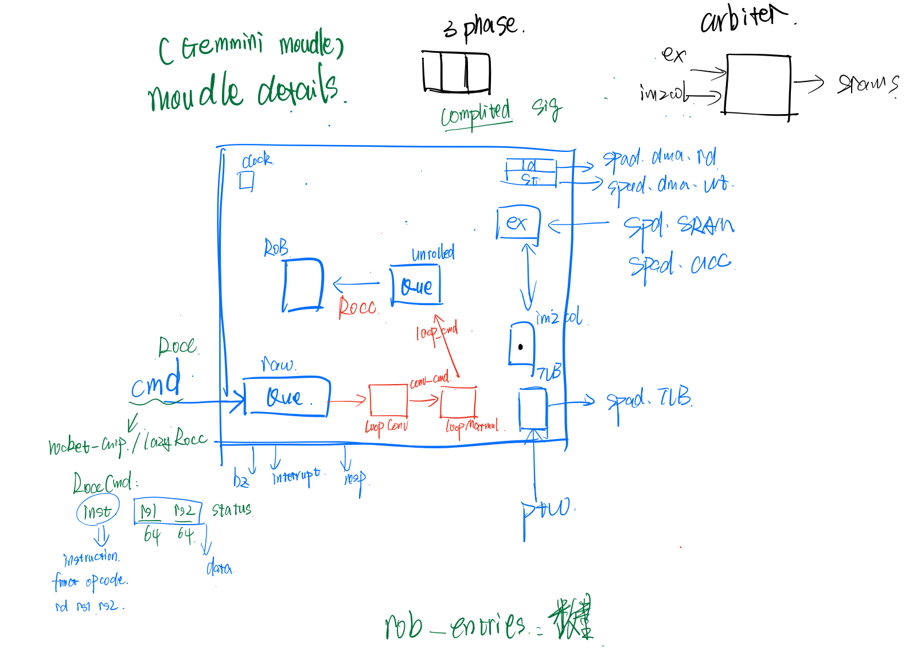
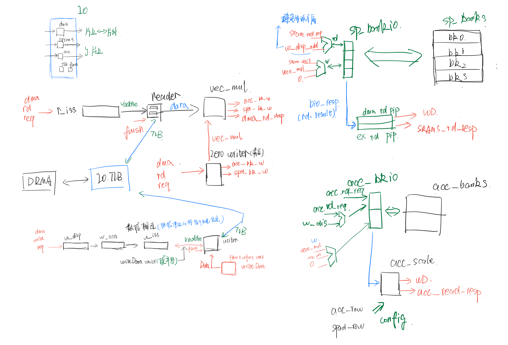
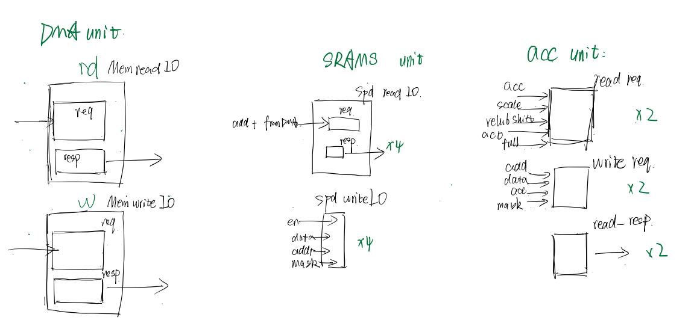
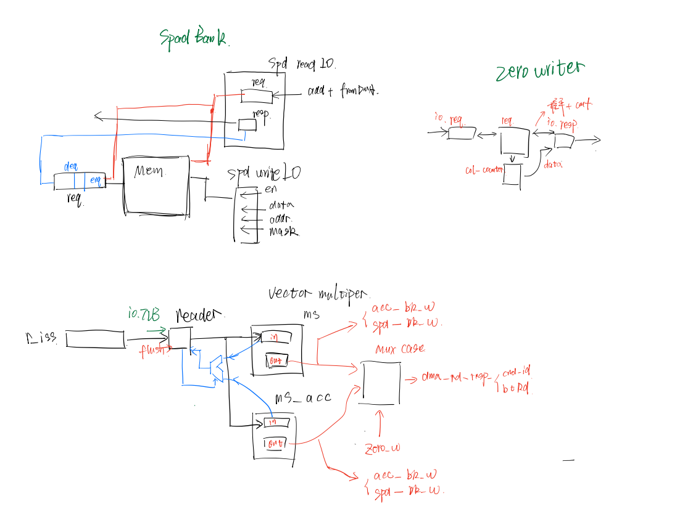
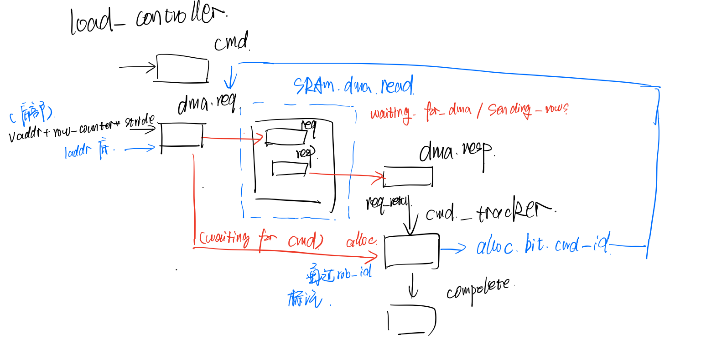
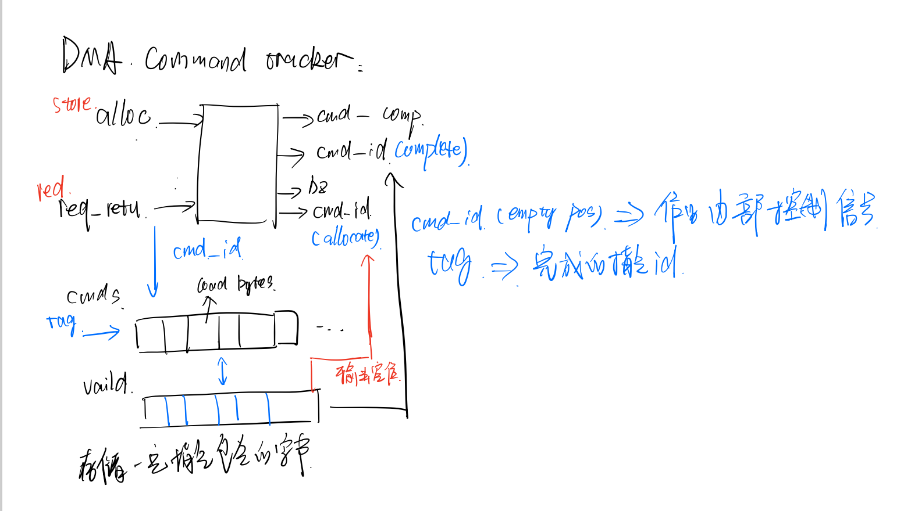

## Gemmini Architecture

In this part, you write about the goals from each component.

### Overall Architechture

### Controller

1. In Controller, the rocc instruction from io.cmd will be unrolled, by loopConv function and loopMatMul function, to a pile of simple Rocc instructions (guess)  to control load,st,ex unit. The unrolled command will be store in the re-order buffer firstly  after being unrolled, decompose the instruction into fundamental instruction.
2. ROB unit as a queue, or buffer, do not relate to the compile process of cmd, so it maybe not be required to change, identified by inst_id.
3. Load,ex,st unit will drive the dma in Spad unit.
4. In load, ex, st controller will compile the rocc instruction into machine instruction.
5. The control have busy and interrupt status judgement and signals.

#### The schema of Controller

### PE + Tile + Mesh

#### PE：

 	1. the previous PE's out_c port will be connected to the next PE's in_d port according to the chisel code in Tile.scala
 	2. PE unit has Mac unit(function) to execute matrix multiplication and addition
 	3. Don't know where to store the weight when WS situation

#### Tile:

​	1. Connect the PE units in series by this form of code, see figure below、

#### Mesh:

​	1. Similar connection logic as Tile Unit

### Execute controller

#### code of Tile.scala to fulfill the connection in series

### Spad module

1. Io.srams will control the sp_bank directly, and also the io.acc

2. There is a vec_mul unit to calculate vector multiplication and write back to the sp_banks and acc_banks

3. Every reading instruction of sp_banks and acc_banks will feedback the result to writer

4. DMA: control the interaction with DRAM and TLB

5. The function of Reader: DRAM -> Spad by TLB + dma.rd.req.vaddr(virtual address), connect with load controller

6. The function of Writer:  Spad -> DRAM by TLB + dma.w.req.vaddr(virtual address), connect with store controller

7. Zero writer:

    1. A small module that update the value of local address, mask, last according to the req config
    2. function: write 0 into banks

    

    #### Unit of Spad

    

    

    ### Load controller, same as store controller

    1. It connects with the read input of DMA in spad, having the assignment to load data from DRAM into spad

    2. There is a cmd tracker to record and track the total byte for each RoccCmd if it has empty position

    3. The load controller uses the idea of FSM to config different signals and wires inside it. There are three states: waiting for cmd, waiting for dma and sending rows. 

    4. At waiting for cmd state, the controller will choose to config the stride, scale, shrink, block_stride arguments or change to next states according to the **funct** of Input RoccCmd. The cmd tracker will  buffer the dma if it has room, by storing the total byte of this command in cmd tracker, and return the position back to dma.req signal. If the cmd tracker doesn't have room to store cmd, the FSM will stay until there is a room. Then if the DMA unit of the spad has finished dealing with the request, then will the FSM go into sending_rows state or waiting for spad's DMA unit finish.

    5. At sending rows state, the machine will wait until the last row has been read into the spad.

    6. For row counter, the row counter is kept in a relative distance with the vaddr of cmd. It marks were the store address begin within the vaddr block decided by **vaddr** and **actual_read_rows** argument of one dma request.(one cmd)

    7. each time there is a dma resp, meaning a part of the instruction has been completed, then the cmd_tracker will update the byte needed to be written.

        

